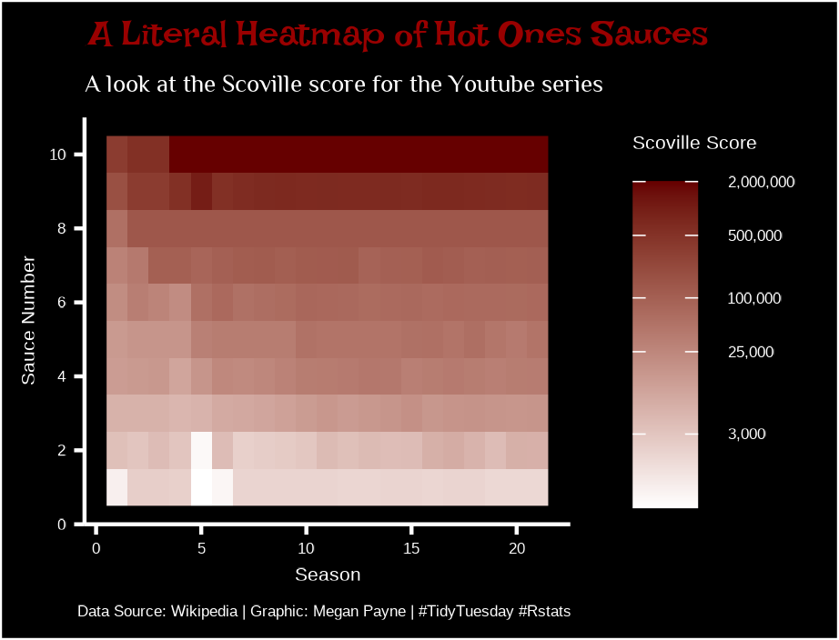

# TidyTuesday

Plots for the #TidyTuesday project - a weekly R #DataVisualization challenge

---

Main repository for the project

---
Week 32 - Hot Ones Youtube Series

[Code](2023/week32_hot_ones.R)

---

Week 21 - Squirrel Census

[Code](2023/week21_squirrel_census.R)

---

Week 12 - Programming Languages

---

Week 8 - Bob Ross Paintings

